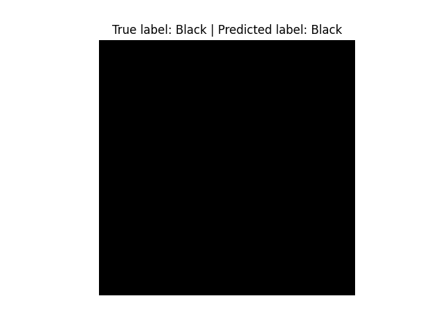
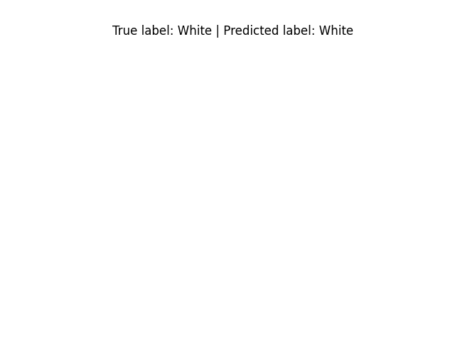
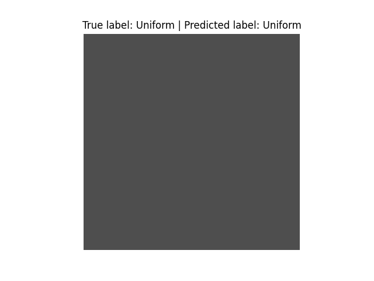
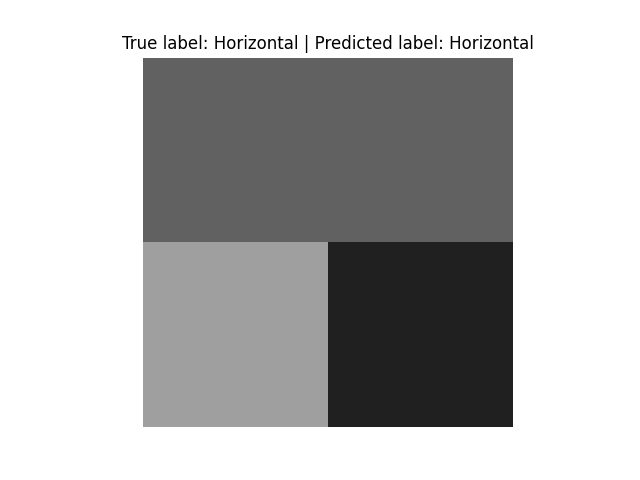
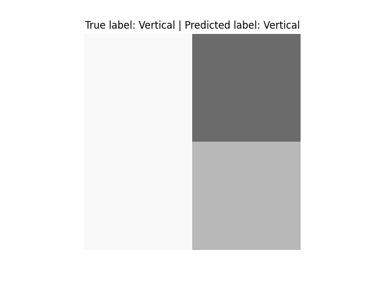
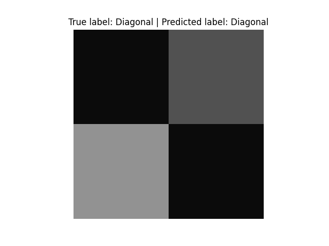
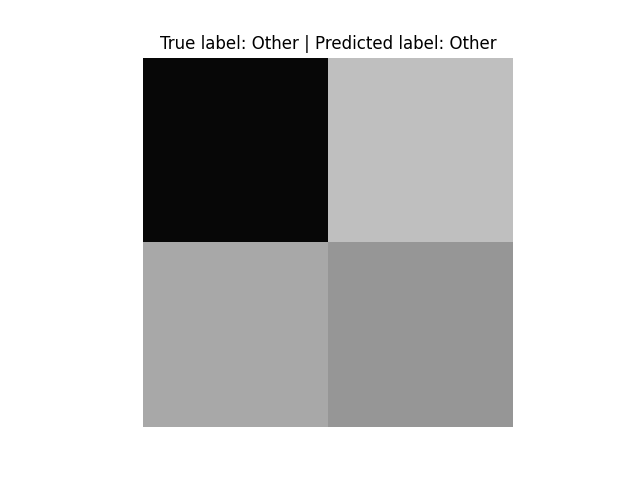

## A Super Simple Image Recognition Neural Network

using TensorFlow, that learns to classify 2x2 grayscale images and predict whether the image is one of (7) classes: black, white, uniform, horizontal, vertical, diagonal, or other. The model is trained on a dataset of (N=21000) 2x2 grayscale images that are custom generated from the [datagen.py](./datagen.py).

Features:
- [x] Input layer, that is a convolutional (2D) layer with 16 filters, kernel size of 2x2, and ReLU activation
- [x] A flatten layer
- [x] Two dense layers with 32 neurons and ReLU activation
- [x] A dropout layer with a dropout rate of 0.3
- [x] Output layer with 7 neurons and softmax activation

## Results

The model is able to achieve ~92% accuracy on the training set and a bit higher ~93% on the validation set. _Newly trained models may vary in performance_ but are able to consistently achieve >89% accuracy. The trained model is saved as [model.h5](./model.h5) and can be used to make predictions on new images.










## Usage

> NOTE: Remember to point the scripts to the correct paths

__Run the Model & Train script__
```py
python model.py
```

__Run the prediction__
```py
python predict.py
```

__Run the data generator__
```py
python datagen.py
```

__View the generated images__
```py
python view_dataset.py
```
