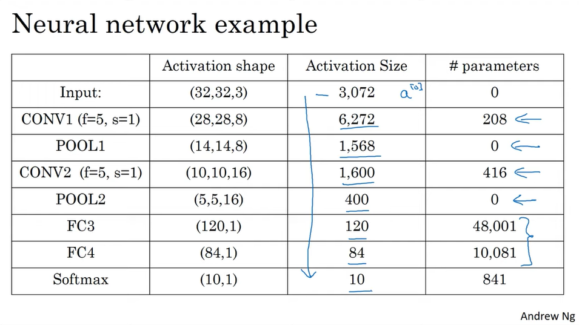

### Edge Detection

3x3 matrix for vertical edge detection

```
-1 0 1
-1 0 1
-1 0 1
```

Example 6x6 matrix

```
3 5 7 4 2 0
1 3 5 6 2 1
0 1 2 3 2 1
5 6 7 8 2 1
1 2 3 4 2 1
0 1 2 3 2 1
```

### Padding

Valid & Same convolution
   1. __Valid__: 
   No padding. n x n input * f x f filter => (n - f + 1) x (n - f + 1) output
   > Example: 6 x 6 input * 3 x 3 filter -> 4 x 4 output
   2. __Same__:
   Pad so that output size is the same as input size. 
   n + 2p - f + 1 = n => p = $\frac{f-1}{2}$
   > Example: 6 x 6 input * 3 x 3 filter -> 6 x 6 output

Number _f_ is commonly referred to as the kernel size, as is often a odd number (3, 5, 7, etc.). The kernel size is a hyperparameter that we can tune.

### Stride Convolution

Instead of moving the filter 1 pixel at a time, we can move it _s_ pixels at a time. This is called stride convolution.

n x n input * f x f filter => $\frac{n + 2p - f}{s} + 1$ x $\frac{n + 2p - f}{s} + 1$ output

Example:
> 7 x 7 input * 3 x 3 filter => $\frac{7 + 2p - 3}{2} + 1$ x $\frac{7 + 2p - 3}{2} + 1$ = 3 x 3 outputs

#### Techinal note on cross-correlation (practice) vs. convolution (textbook)

In the context of CNNs, the term convolution is used to describe the process of applying a filter to an input. However, strictly speaking, this is actually an operation known as cross-correlation, which is similar to convolution but without flipping the filter. In practice, this difference is not important, as the filter weights are learned during training and can be flipped either way.

### Convolutions over volumes

RGB images are 3D arrays of numbers, with a height, width, and depth dimension. The depth dimension is 3 for the red, green, and blue channels. We can apply a filter to each of these channels, and then add the results together to produce a single output channel. This is called a depth column or a channel.

Example:

n x n x d input * f x f x d filter => (n - f + 1) x (n - f + 1) x $d_{prime}$ output
> where $d_{prime}$ is the number of filters

Applying 6 x 6 x 3 input to 2 filters:
6 x 6 x 3 input * 3 x 3 x 3 filter => 4 x 4 x 1 output
6 x 6 x 3 input * 3 x 3 x 5 filter => 4 x 4 x 5 output

Resulting in a 4 x 4 x 6 output

### One layer of a CNN

Example of a layer

1. 6 x 6 x 3 input * 3 x 3 x 3 filter => ReLU(4 x 4 + $b_1$) => 4 x 4 x 1 output

> The output of a 3x3 filter on a 6x6x3 input will be a 4x4x1 tensor. This is because as the filter slides over the input, it will apply the dot product between the filter weights and the corresponding section of the input. The output of each dot product operation will be a single value, resulting in a 4x4x1 tensor.

2. 6 x 6 x 3 input * 3 x 3 x 5 filter => ReLU(4 x 4 + $b_2$) => 4 x 4 x 5 output 

> The output of a 3x3x5 filter on a 6x6x3 input will be a 4x4x5 tensor. This is because the output of each dot product operation between the filter and input will produce a 4x4x1 tensor for each of the 5 channels in the filter, resulting in a 4x4x5 tensor as the final output.

_Input_:
$a^{[0]}$ = 6 x 6 x 3

_Filter 1_:
$w^{[0]}_1$ = 3 x 3 x 3 filter
$z^{[0]}_1$ = $w^{[0]}_1$ * $a^{[0]}_1$ + $b^{[0]}_1$ = 4 x 4 x 1 output

_Filter 2_:
$w^{[0]}_2$ = 3 x 3 x 5 filter
$z^{[0]}_2$ = $w^{[0]}_2$ * $a^{[0]}_2$ + $b^{[0]}_2$ = 4 x 4 x 5 output

_Output_:
$a^1$ = $z^{[0]}_1$ + $z^{[0]}_2$ = 4 x 4 x 6 output

__Execise 1__:
Number of parameters in a CNN layer
> If you have 10 filters that are 3x3x3 in one layer of a neural network, how many parameters does that layer have (including the bias parameters)?

Each filter has 3 x 3 x 3 + 1 = 28 parameters. 10 filters have 28 x 10 = 280 parameters.

> The input could be 1000x1000 or 5000x5000, the number of parameters is the same. This is one of the properties of CNNs that makes them less prone to overfitting.

#### Summary of notation:

If layer l is a convolutional layer:
$f^{[l]}$ = filter size
$p^{[l]}$ = padding
$s^{[l]}$ = stride

Input: $a^{[l-1]}$ = $n^{[l-1]}_H$ x $n^{[l-1]}_W$ x $n^{[l-1]}_C$

Output: $a^{[l]}$ = $n^{[l]}_H$ x $n^{[l]}_W$ x $n^{[l]}_C$

Where:
$n^{[l]}_H$ = $\frac{n^{[l-1]}_H + 2p^{[l]} - f^{[l]}}{s^{[l]}} + 1$
$n^{[l]}_W$ = $\frac{n^{[l-1]}_W + 2p^{[l]} - f^{[l]}}{s^{[l]}} + 1$
$n^{[l]}_C$ = number of filters
   - Each filter is $f^{[l]}$ x $f^{[l]}$ x $n^{[l-1]}_C$
   - The number of filters <u>must</u> match the depth of the input volume

Activations: $z^{[l]}$ = $n^{[l]}_H$ x $n^{[l]}_W$ x $n^{[l]}_C$
Weights: $w^{[l]}$ = $f^{[l]}$ x $f^{[l]}$ x $n^{[l-1]}_C$ x $n^{[l]}_C$
bias: $b^{[l]}$ = $n^{[l]}_C$ = (1, 1, 1, $n^{[l]}_C$)

### Simple convolutional network (ConvNet) example

An image is 39 x 39 x 3. The first layer is a convolutional layer with 10 filters of size 3 x 3, stride of 1, and no padding. The second layer is a pooling layer with a filter size of 4 x 4 and a stride of 4. The third layer is a convolutional layer with 20 filters of size 5 x 5, stride of 1, and padding of 2. The fourth layer is a pooling layer with a filter size of 2 x 2 and a stride of 2. The fifth layer is a fully connected layer with 6 nodes.

__Input__: 39 x 39 x 3
$n^{[0]}_H$ = $n^{[0]}_W$ = 39
$n^{[0]}_C$ = 3

__Filter 1__: 3 x 3 x 3
$f^{[1]}$ = 3
$s^{[1]}$ = 1
$p^{[1]}$ = 0
Let's say we have 10 filters

The next layer of this nn will be 37 x 37 x 10

$n^{[1]}_H$ = $\frac{n^{[0]}_H + 2p^{[1]} - f^{[1]}}{s^{[1]}} + 1$ = $\frac{39 + 2(0) - 3}{1} + 1$ = 37 = $n^{[1]}_W$
$n^{[1]}_C$ = 10

Let's say we have another CNN layer.
$f^{[2]}$ = 5
$s^{[2]}$ = 2
$p^{[2]}$ = 0
Let's say we have 20 filters

The output of this will be 17 x 17 x 20 from the previous layer of 37 x 37 x 10 because of the stride of 2.

$n^{[2]}_H$ = $\frac{n^{[1]}_H + 2p^{[2]} - f^{[2]}}{s^{[2]}} + 1$ = $\frac{37 + 2(0) - 5}{2} + 1$ = 17 = $n^{[2]}_W$
$n^{[2]}_C$ = 20

Let's say we have another CNN layer.
$f^{[3]}$ = 5
$s^{[3]}$ = 2
$p^{[3]}$ = 0
Let's say we have 40 filters

The output of this will be 7 x 7 x 40 (40 features).

Then we flatten the output to 7 x 7 x 40 = 1960 numbers as a vector.

Then we feed this into a logistic regression unit or a softmax unit to get $y^{hat}$.

> A lot of the work in designing CNNs is in choosing the hyperparameters, such as the number of layers and the number of filters in each layer.

### Common types of layers in a ConvNet

- Convolutional layer (Conv)
- Pooling layer (Pooling or Pool)
- Fully connected layer (FC)

Fortunately, pooling layers and fully connected layers are simplier to design than convolutional layers.

### Pooling layers

__Max pooling__:

Hyperparameters:
- $f$ = filter size
- $s$ = stride
_No parameters to learn for gradient descent_. Once you know the hyperparameters, it will just be a fixed computation.

Suppose we have a 4 x 4 input and we want to apply max pooling to get an output of 2 x 2.

```
1 3 2 1
2 9 1 1
1 3 2 3
5 6 1 2
```

We will use a 2 x 2 filter with a stride of 2. We take the max of each 2 x 2 filter and put it into the output.

```
9 2
6 3
```

> For _multiple channels_, we apply max pooling to each channel independently. If we have a 4 x 4 x 3 input and we will use max pooling to get an output of 2 x 2 x 3.

__Average pooling__:

```
1 3 2 1
2 9 1 1
1 3 2 3
5 6 1 2
```

Output:
```
3.75 1.25
4 2
```

> Often max pooling is used much more often than average pooling. With one exception, if you're working with a fully connected layer, then average pooling is more common.

#### Summary of pooling

Hyperparameters:
- $f$ = filter size
- $s$ = stride
Commonly $f$ = 2 and $s$ = 2
Max or average pooling
No parameters to learn (for both max and average pooling)

### Neural network example

Suppose we have an image of 32 x 32 x 3 and we want to recognize the number

__Input__: 32 x 32 x 3
$n^{[0]}_H$ = $n^{[0]}_W$ = 32
$n^{[0]}_C$ = 3

__Filter 1__: 5 x 5 x 3
$f^{[1]}$ = 5
$s^{[1]}$ = 1
$p^{[1]}$ = 0

We apply 6 filters, add a bias, and apply the ReLU activation function.

__Output__ (Conv 1): 28 x 28 x 6

Then, we apply a max pooling layer with a filter size of 2 x 2 and a stride of 2.
$f^{[2]}$ = 2
$s^{[2]}$ = 2

__Output__ (Pool 1): 14 x 14 x 6

__Layer 1__ = (Conv 1 & Pool 1)

> When people report the number of layers in a ConvNet, they do not count the pooling layers or the fully connected layer because they have no parameters or weights.

Then, we apply a 5 x 5 x 16
$f$ = 5
$s$ = 1

__Output__ (Conv 2): 10 x 10 x 16

Then, we apply a max pooling layer with a filter size of 2 x 2 and a stride of 2.

__Output__ (Pool 2): 5 x 5 x 16

__Layer 2__ = (Conv 2 & Pool 2)

Then, we flatten the output to 400 numbers as a 1D vector.

Then, we feed this into a fully connected layer with 120 hidden units.

FC 3: 120
$w^{[3]}$ = (120, 400)
$b^{[3]}$ = (120)

Then, we add another fully connected layer with 84 hidden units.

FC 4: 84

Then, we feed this into a softmax layer to get $y^{hat}$. The softmax layer will have 10 units because we have 10 classes of numbers for digits 0-9.

Activation size usually goes down gradually and not suddenly.



### Why convolutions?

- __Parameter sharing__: this means a feature detector (such as a vertical edge detector) that's useful in one part of the image is probably useful in another part of the image.
- __Sparsity of connections__: this means in each layer, each output value depends only on a small number of inputs. This is in contrast to a fully connected layer where each output depends on every input. This is useful because it allows us to use more parameters in the next layer without making the network too big.

### Training a CNN

Training set ($x^{(1)}, y^{(1)}$)... ($x^{(m)}, y^{(m)}$)

Cost $J = \frac{1}{m} \sum_{i=1}^{m} L(\hat{y}^{(i)}, y^{(i)})$

Use gradient descent to minimize the cost function J.

